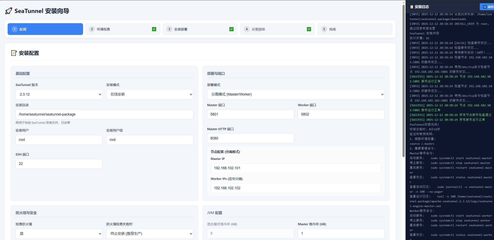

# 🚀 SeaTunnel 一键安装指南
SeaTunnel 是一个高性能、分布式的数据集成平台，支持实时和批量数据同步。本指南将帮助您快速完成 SeaTunnel 的 Zeta 集群安装部署。
Flink/Spark 模式请自行适配。
## 支持版本
| 版本 | 状态 |
|------|------|
| 2.3.12 | ✅ 已测试 |
| 2.3.11 | ✅ 已测试 |
| 2.3.10 | ✅ 已测试 |
| 2.3.9 | ✅ 已测试 |
| 2.3.8 | ✅ 已测试 |
| 2.3.7 | ✅ 已测试 |
| 2.3.6 | ✅ 已测试 |

## 兼容系统
| 操作系统 | 版本 | 状态 |
|----------|------|------|
| CentOS | 7.4+ | ✅ 已验证 |
| Rocky Linux | 9.1+ | ✅ 已验证 |
| Ubuntu | 20.04+ | 🚧 理论可行，未验证 |
| Debian | 11+ | 🚧 理论可行，未验证 |
| OpenEuler | 20.03+ | 🚧 理论可行，未验证 |
| 银河麒麟 | V10(sp1,sp2,sp3) | 🚧 理论可行，未验证 |
| 深度 | V20+ | 🚧 理论可行，未验证 |
| 统信 | V20+ | 🚧 理论可行，未验证 |

## 架构与运维扩展规划
- 控制面：Web + API 统一管理集群、任务、凭证、插件；提供 RBAC、多租户、审计。
- Agent/探针：部署在节点，负责健康检查、指标/日志上报（Prometheus/Loki/ES）、执行运维动作（重启、自愈、扩缩容脚本）。
- 可观测与告警：内置 Seatunnel 指标规范（吞吐/延迟/失败率/CPU/内存），预置 Grafana 仪表盘与 Alertmanager 告警规则，多渠道通知（钉钉/企微/邮件）。
- 任务全生命周期：任务模板/YAML 描述 + 表单编辑，版本化、Diff/回滚，提交/调度/重试/回滚，运行日志流，失败原因提示。
- 运维工具箱：一键诊断（收集 job/节点日志、JVM/GC/线程 dump、配置快照），常见故障指纹匹配 → 解决方案/一键修复脚本。
- 弹性与发布：按指标阈值或队列长度自动扩/缩容，滚动/金丝雀/蓝绿发布，任务级回滚，插件/connector 市场（安装/升级/禁用）。

## 路线图（建议）
1) 可观测先行：定义指标/日志标签，接 Prometheus + Grafana + Alertmanager，交付预置 dashboard 与告警。
2) 任务与配置：Web 增加任务列表/详情，支持 YAML/表单编辑、版本化、Diff/回滚，GitOps 化提交。
3) 诊断与故障库：提供 `diagnose.sh`/Agent 收集日志+指标快照，UI 下载；基于日志特征匹配常见问题并给出操作建议。
4) 弹性与发布：先手动扩缩容与滚动发布，再加自动策略（阈值/预测），支持金丝雀/蓝绿。
5) 安全与生态：RBAC、多租户、审计；插件/connector 市场与 SDK，便于社区贡献与扩展。

## Web UI 原型（文本线框）
- 总览 Dashboard  
  - 顶部卡片：集群健康/节点数/版本；任务成功率；延迟 P50/P95；吞吐；告警计数。  
  - 图表：任务成功率与失败数（折线+柱）；延迟/吞吐；资源利用（CPU/Mem）。  
  - 右侧：告警气泡列表（级别/对象/时间/操作）。  
  - 底部：最近任务表（状态/耗时/错误摘要）+ 最近告警。

- 任务列表  
  - 筛选：状态、类型（流/批）、标签、时间。  
  - 表格：任务名 | 状态 | 版本 | 触发方式 | 最近运行 | 耗时 | 重试/回滚 | 查看日志。  
  - 顶部按钮：新建任务（模板选择）、批量重试、导入/导出。

- 任务详情  
  - Header：名称、版本、状态、触发信息，操作（重试/回滚/停止）。  
  - 时间线：提交 → 调度 → 启动 → 运行 → 结束/失败（显示耗时）。  
  - 指标卡：延迟、吞吐、失败率、队列长度/背压。  
  - 实时日志流（按 level/component 过滤）+ 事件流（调度/重启/扩缩容事件）。  
  - 配置与版本：YAML/表单切换，Diff，版本回滚。  
  - IO 视图：Source/Sink 一览，数据预览（采样）。

- 提交/编辑任务  
  - 模板选择（批/流/DAG），表单与 YAML 双模式；参数校验；预览执行计划。  
  - 调度：Cron/事件/手动；并发/优先级；重试策略。  
  - 发布策略：滚动/金丝雀（流量百分比）；预检按钮。  
  - 保存版本，GitOps 模式可生成 PR。

- 集群/节点  
  - 概览卡：节点数、可用性、资源水位、版本分布。  
  - 节点表：IP/角色/版本/CPU/Mem/磁盘/状态/心跳，操作（重启/隔离/升级）。  
  - 扩缩容面板：手动或策略（阈值/预测）；执行记录。  
  - 发布管理：滚动/金丝雀/蓝绿，进度与回滚。

- 诊断中心  
  - 一键诊断：选择范围（节点/任务），勾选内容（日志/线程 dump/GC/配置），生成诊断包并提供下载。  
  - 故障指纹：日志特征 → 解决方案/一键修复脚本。  
  - 历史诊断：时间、对象、结果、下载链接。

- 插件市场  
  - 列表：名称/类型（Source/Sink/Transform）/版本/兼容性/状态，操作（安装/升级/禁用）。  
  - 详情：能力说明、配置示例、变更记录、依赖检查。

- 设置/安全  
  - 凭证与连接：数据源密钥/连接管理。  
  - RBAC/多租户：用户、角色、命名空间/队列隔离。  
  - 通知与告警渠道：钉钉/企微/邮件/短信；SLO/SLA 设置。  
  - 审计日志：操作轨迹、导出。


[](LICENSE)

## 项目初衷

这个一键安装工具的目标很简单：

- 降低 SeaTunnel 安装和配置门槛，快速拉起一个可用集群
- 支持单节点 / 多节点、混合 / 分离等多种部署模式，方便体验和测试
- 内置常用连接器、systemd 服务和运维脚本，开箱即用

## 快速开始

### 1. 单节点安装(默认root用户)

#### 方式一：GitHub下载（国外推荐）
```bash
# 第一步：下载并解压
curl -s https://api.github.com/repos/LeonYoah/seatunnel-installer/releases/latest | grep "tag_name" | cut -d '"' -f 4 | xargs -I {} sh -c 'mkdir -p ~/seatunnel-installer && cd ~/seatunnel-installer && wget https://github.com/LeonYoah/seatunnel-installer/archive/refs/tags/{}.tar.gz -O- | tar -xz'

# 第二步：进入目录并执行安装
cd ~/seatunnel-installer/seatunnel-installer-* && chmod +x install_seatunnel.sh

# 完整安装（含插件）
./install_seatunnel.sh

# 仅安装核心组件（不含插件）
./install_seatunnel.sh --no-plugins

# 在已有安装的seatunnel中更新插件
./install_seatunnel.sh --install-plugins
```

#### 方式二：Gitee下载（国内推荐）
```bash
# 第一步：下载并解压
curl -s https://gitee.com/api/v5/repos/lyb173/seatunnel-installer/releases/latest | grep -o '"tag_name":"[^\"]*' | cut -d'"' -f4 | xargs -I {} sh -c 'mkdir -p ~/seatunnel-installer && cd ~/seatunnel-installer && wget https://gitee.com/lyb173/seatunnel-installer/repository/archive/{}.tar.gz -O- | tar -xz'

# 第二步：进入目录并执行安装
cd ~/seatunnel-installer/seatunnel-installer-* && chmod +x install_seatunnel.sh

# 完整安装（含插件）
./install_seatunnel.sh

# 仅安装核心组件（不含插件）
./install_seatunnel.sh --no-plugins

# 在已有安装的seatunnel中更新插件
./install_seatunnel.sh --install-plugins
```

> 如果你已经手动下载并进入安装目录，也可以直接执行：
> 
> ```bash
> chmod +x install_seatunnel.sh
> ./install_seatunnel.sh          # 使用 config.properties 中的配置
> ```

### 2. Web 安装向导（推荐）

本仓库内置了一个 Web 安装向导，适合希望通过页面一步步完成配置和安装的场景。

```bash
chmod +x start_web.sh
./start_web.sh start              # 默认端口启动


## 其他参数
./start_web.sh -p 9000 start      # 端口9000启动
./start_web.sh -c start           # 清理后启动
./start_web.sh -c -p 9000 start   # 清理后端口9000启动
./start_web.sh stop               # 停止
./start_web.sh clean              # 仅清理临时文件
```

启动成功后终端会输出类似信息：

```text
============================================
SeaTunnel Web 安装向导已启动!
============================================

访问: http://<当前机器IP>:8888
CLI:  ./install_seatunnel.sh --help
```

在浏览器中访问上述地址：

- 在「安装配置」页填写基础信息（安装目录、部署模式、节点 IP、安装模式 online/offline 等）
- 支持在线/离线安装、混合/分离部署、HDFS/OSS/S3 检查点存储等配置
- 点击「保存配置并开始安装」，右侧日志区域实时展示安装过程
- 每个步骤都有状态和操作按钮，可以单步执行、重试、从指定步骤继续等

示例界面截图：



> 提示：Web 安装向导本质上还是调用同一个 `install_seatunnel.sh`，只是通过页面帮你编辑 `config.properties` 并按步骤执行。

---

## 常用配置示例（config.properties）

`config.properties` 是所有安装方式的唯一配置入口，以下是一个典型示例（仅保留常用项）：

```properties
SEATUNNEL_VERSION=2.3.12

# 安装模式
INSTALL_MODE=online          # online / offline
PACKAGE_PATH=/path/to/apache-seatunnel-${SEATUNNEL_VERSION}-bin.tar.gz

# 安装目录
BASE_DIR=/home/seatunnel/seatunnel-package

# 部署模式
DEPLOY_MODE=separated        # separated / hybrid

# 分离模式节点
MASTER_IP=192.168.102.101
WORKER_IPS=192.168.102.102

# 混合模式节点
CLUSTER_NODES=192.168.102.101,192.168.102.102

# 端口配置
HYBRID_PORT=5801
MASTER_PORT=5801
WORKER_PORT=5802
MASTER_HTTP_PORT=8080

# JVM 内存配置（GB）
HYBRID_HEAP_SIZE=3
MASTER_HEAP_SIZE=1
WORKER_HEAP_SIZE=3

# 检查点存储
CHECKPOINT_STORAGE_TYPE=LOCAL_FILE   # LOCAL_FILE / HDFS / OSS / S3
CHECKPOINT_NAMESPACE=/tmp/seatunnel/checkpoint/

# systemd 自启动
ENABLE_AUTO_START=true
```

> 建议：先用 Web 向导在浏览器里把配置填好并保存，然后再根据需要手动查看/微调 `config.properties`。

---

## 多节点 / 部署模式要点

- **分离模式（DEPLOY_MODE=separated）**
  - Master 负责控制与协调，Worker 负责执行任务
  - 必须配置 `MASTER_IP` 和 `WORKER_IPS`
  - 端口主要使用 `MASTER_PORT` / `WORKER_PORT` / `MASTER_HTTP_PORT`

- **混合模式（DEPLOY_MODE=hybrid）**
  - 所有节点角色相同，统一写在 `CLUSTER_NODES`
  - 端口主要使用 `HYBRID_PORT`（集群）和 `MASTER_HTTP_PORT`（Web/REST）

> 生产环境部署建议使用分离模式，并结合 HDFS / OSS / S3 作为检查点存储。

---

## 卸载 SeaTunnel

卸载脚本会根据 `config.properties` 中的配置，安全地停止服务并删除安装目录、Java 软链接、systemd 配置等。

```bash
chmod +x uninstall_seatunnel.sh
./uninstall_seatunnel.sh
```

> 卸载前请确认：
> - 不再需要当前集群和相关数据
> - 所有重要配置和日志已自行备份

---

## systemd 服务管理（安装完成后）

如果在配置中开启了 `ENABLE_AUTO_START=true`，安装脚本会自动生成 systemd 服务：

- 混合模式：`seatunnel`
- 分离模式：`seatunnel-master`、`seatunnel-worker`

常用命令示例：

```bash
# Master 节点
sudo systemctl start seatunnel-master
sudo systemctl status seatunnel-master

# Worker 节点
sudo systemctl start seatunnel-worker
sudo systemctl status seatunnel-worker

# 查看日志
sudo journalctl -u seatunnel-master -n 100 --no-pager
sudo journalctl -u seatunnel-worker -n 100 --no-pager
```

---

## 更多信息

- 更复杂的连接器/依赖配置，请直接参考 `config.properties` 中的注释
- SeaTunnel 官方文档：https://seatunnel.apache.org/docs

本 README 仅保留最常用的安装和运行方式，便于快速上手，其余细节以实际脚本和配置文件为准。
